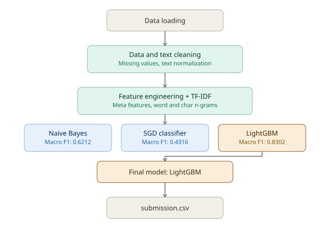

# Comment Category Prediction Challenge


**Kaggle Competition:** [comment-category-prediction-challenge](https://www.kaggle.com/competitions/comment-category-prediction-challenge)

A machine learning pipeline that classifies online comments into one of four platform-defined handling categories, using text content, engagement signals, and metadata. Built as a Kaggle competition submission, evaluated on **Macro F1**. Three model families were trained and compared, with the best baseline selected as the final model.

## Overview

Social platforms tag comments into internal handling categories based on content and context — not just toxicity, but a mix of signals including engagement, hidden platform features, and detected topic references. This project builds an end-to-end pipeline to predict that category (`label`) for unseen comments, and compares multiple modeling approaches before picking a final one.

- **Train set:** 198,000 rows × 15 columns
- **Test set:** 102,000 rows × 14 columns
- **Target:** `label` — 4 classes, heavily imbalanced (57.7% / 8.0% / 31.5% / 2.8%)
- **Metric:** Macro F1
- **Final result:** Validation Macro F1 = **0.8302** (LightGBM)

## Pipeline architecture



## Dataset

| Column | Description |
|---|---|
| `comment` | Raw text content of the comment |
| `created_date` | Timestamp the comment was posted |
| `post_id` | ID linking the comment to its parent discussion thread |
| `emoticon_1/2/3` | Presence indicators for three internal emoticon groups |
| `upvote` / `downvote` | Engagement counts |
| `if_1` / `if_2` | Hidden internal platform features |
| `race`, `religion`, `gender`, `disability` | Indicators for detected topic references |
| `label` | Target — final handling category (4 classes) |

## Pipeline

**1. Data Cleaning**
- Parsed `created_date` to datetime; imputed missing categorical/numeric fields
- Normalized `disability` to int, cast vote/emoticon/internal features to numeric

**2. Text Cleaning**
- Lowercased text, stripped URLs and HTML tags, removed non-alphanumeric noise while preserving `!` / `?`, collapsed whitespace

**3. Exploratory Data Analysis**
- Label distribution, comment length distribution, missing value checks, correlation heatmap across numeric features

**4. Feature Engineering**
- **Datetime:** year, month, day, hour, day-of-week, weekend flag
- **Text stats:** length, word count, avg word length, exclamation/question counts, uppercase ratio, unique word ratio, punctuation count/ratio, URL count, sentence count, repeated-character count, "toxic punctuation" (`!!`, `??`), capitalized word count
- **Vote-based:** vote ratio, total votes, vote sentiment (upvote − downvote), log-transformed votes
- **Emoticon-based:** total emoticons, has-emoticon flag, emoticon ratio
- **`if_2` bucketing:** binary flags for specific values + binned ranges
- **Interaction features:** products/crosses of `if_1`, `if_2`, votes, comment length, disability flag
- **Post-level aggregation:** per-`post_id` mean/std/max of upvotes and downvotes, comment count, and a Bayesian-smoothed target encoding of `label` (k=5 smoothing, computed on train and mapped to test to avoid leakage)

**5. Text Vectorization (TF-IDF)**
- **Word-level:** unigrams + bigrams, max 50,000 features, sublinear TF scaling
- **Character-level:** char n-grams (3–4), max 30,000 features, word-boundary aware — captures misspellings, slang, and obfuscated text

**6. Feature Assembly**
- Label-encoded categorical columns (`race`, `religion`, `gender`)
- ~50 engineered meta-features combined with word and char TF-IDF matrices into a single sparse feature matrix via `scipy.sparse.hstack`

**7. Train/Validation Split**
- Stratified 85/15 split preserving class proportions

**8. Modeling — Baseline Comparison**

Three models were trained on the same feature matrix and compared:

| Model | Notes |
|---|---|
| **Complement Naive Bayes** | Word TF-IDF only (first 50k columns), `alpha=0.1` |
| **SGD Classifier** | Full feature matrix, `loss='modified_huber'`, `class_weight='balanced'` |
| **LightGBM** | Full feature matrix, 1,500 estimators, `class_weight='balanced'`, early stopping on multi-logloss |

**9. Hyperparameter Tuning**
- **Naive Bayes:** `GridSearchCV` over `alpha ∈ {0.01, 0.1, 0.5, 1.0, 2.0}`, 3-fold CV
- **SGD:** `GridSearchCV` over `alpha ∈ {1e-5, 1e-4, 1e-3}` with early stopping, 3-fold CV
- LightGBM baseline was retained as-is (already outperformed both tuned linear models)

**10. Model Selection**
- All baseline and tuned scores compared side-by-side (bar charts included in notebooks)
- **LightGBM baseline selected as the final model** — clear margin over both linear/probabilistic alternatives

**11. Prediction & Submission**
- Generated predictions on the test set using the final LightGBM model and wrote `submission.csv` in the competition's required format

## Results

### Model Comparison (Macro F1)

| Model | Baseline | Tuned |
|---|---|---|
| Naive Bayes (ComplementNB) | 0.6212 | 0.6226 (+0.0013) |
| SGD Classifier | 0.4316 | 0.3280 (−0.1036) |
| **LightGBM** | **0.8302** | — (selected as final) |

Naive Bayes barely improved with tuning, and SGD tuning made results *worse* — both were dominated by LightGBM's ability to combine sparse TF-IDF signals with the engineered meta-features nonlinearly.

### Final Model — LightGBM Classification Report

| Class | Precision | Recall | F1-score | Support |
|---|---|---|---|---|
| 0 | 0.9835 | 0.9467 | 0.9648 | 17,126 |
| 1 | 0.7312 | 0.8451 | 0.7840 | 2,388 |
| 2 | 0.8835 | 0.9028 | 0.8931 | 9,366 |
| 3 | 0.6546 | 0.7049 | 0.6788 | 820 |

**Macro F1: 0.8302** | **Accuracy: 91.80%**

The model performs strongly on the majority classes (0 and 2) and reasonably on the minority classes (1 and 3), aided by `class_weight='balanced'` and the Bayesian-smoothed post-level target encoding.

## Tech Stack

- **Data processing:** pandas, NumPy
- **Visualization:** matplotlib, seaborn
- **NLP:** scikit-learn (`TfidfVectorizer`)
- **Modeling:** scikit-learn (`ComplementNB`, `SGDClassifier`, `GridSearchCV`), LightGBM
- **Evaluation:** scikit-learn metrics (Macro F1, classification report)

## Project Structure

```
├── notebooks/
│   ├── 01_naive_bayes.ipynb      # Naive Bayes baseline + tuning
│   ├── 02_sgd.ipynb              # SGD classifier baseline + tuning
│   └── 03_lightgbm_final.ipynb   # LightGBM — final model
├── assets/
│   └── pipeline_diagram.svg      # Pipeline architecture diagram
├── requirements.txt              # Python dependencies
├── LICENSE                       # MIT license
├── .gitignore
├── README.md
├── train.csv                     # Training data (not included — see Kaggle competition)
├── test.csv                      # Test data (not included — see Kaggle competition)
├── sample_submission.csv         # Submission format reference
└── submission.csv                # Final predictions
```

## How to Run

1. Clone this repo and install dependencies:
   ```bash
   pip install -r requirements.txt
   ```
2. Download `train.csv`, `test.csv`, and `sample_submission.csv` from the [Kaggle competition page](https://www.kaggle.com/competitions/comment-category-prediction-challenge) and place them in the input directory (notebooks auto-detect paths under `/kaggle/input` on Kaggle; adjust `DATA_PATH` for local runs)
3. Run each notebook top to bottom
4. `submission.csv` is generated with `ID` and predicted `label` columns

## Future Improvements

- Ensemble LightGBM with a transformer-based text encoder for a diversity boost
- Broader hyperparameter search for LightGBM itself (Optuna) rather than only tuning the weaker baselines
- SMOTE or focal loss as alternatives to class-weight balancing for the minority classes
- Cross-validation instead of a single hold-out split for a more robust F1 estimate

## License

This project is licensed under the [MIT License](LICENSE).
